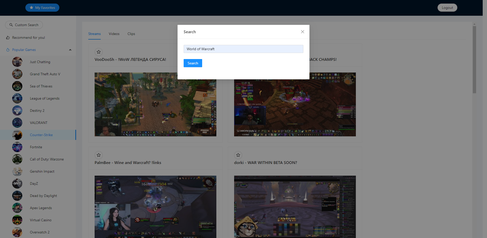

# Pocket Twitch Player

This project is a twitch player that recommends personalized twitch contents to the users.

Users can search for Twitch resources such as streams, videos, and clips on the app. The client adoptes React and Ant Design for an engaging and intuitive user experience. The HTTP requests and responses are handled by Java SpringBoot. Data is stored in MySQL database and integrated with Amazon RDS for simplicity and scalability. Features like login, logout, and favorite collection are added for improved user experience. Relavent Twitch resources are recommended from user activity via a content-based recommendation algorithm.

## Demonstration

This is the home page of the application.

Different twitch resources are extracted from twitchAPI, including streams, videos and clips and recommended to all users:

Users have the options to register and login for better user experience:

They can watch Twitch resources by each category:

Search for categories more explicitly:

Set and view favorite resources:

and get more personalized recommendations from viewed contents:

